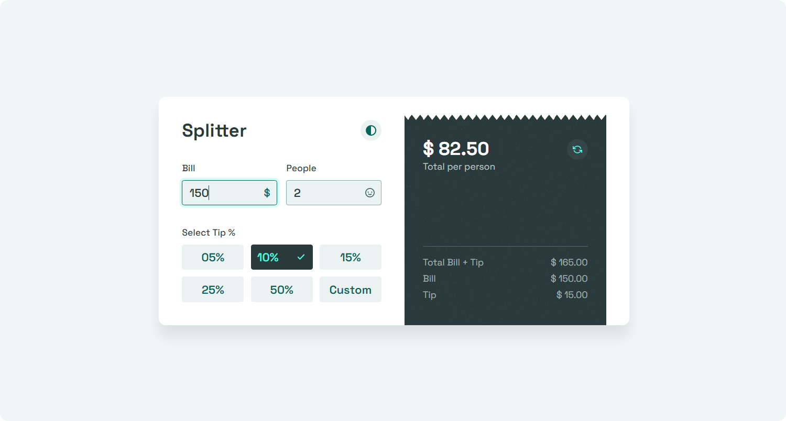
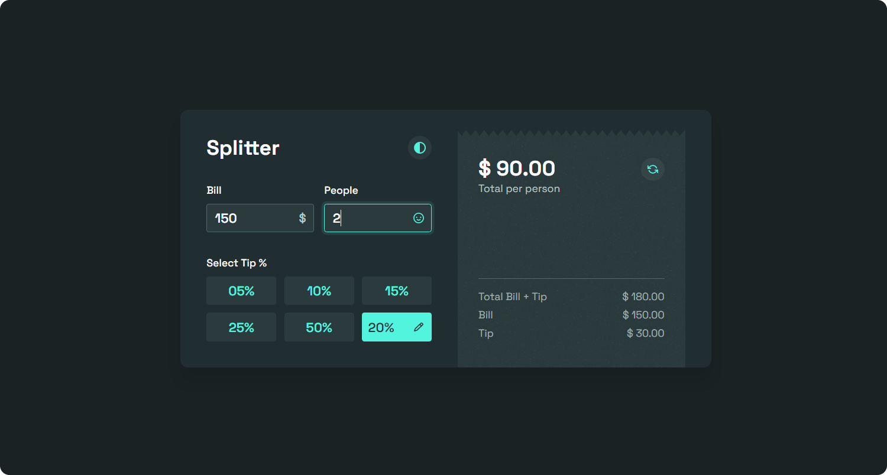
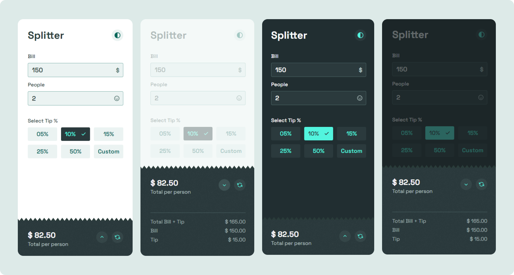

# Bill-splitting app

Bill-splitting calculator buit with HTML, CSS (SASS) and JavaScript. [Interact with the live project here](https://douglasf5.github.io/bill-splitting-app/).

Implemented features:

- Real time feedback based on user's input
- Responsive layout
- Configurable color theme

 

## Project screenshots

 
 
 

 

## Extra notes

- As a beginner exercise, this project wasn’t focused on advanced optimizations regarding data storage, processing, accessibility, scalability, cross-browser compatibility, etc. There’s still a lot to be done about it.
- This project was proposed by Frontend Mentor.
- The UI was completely redesigned for this exercise.
- As most projects, this one is not bug/error-free. If you find any bug or unexpected behavior, feel free to get in touch, here is my email - dfaferreira46@gmail.com
